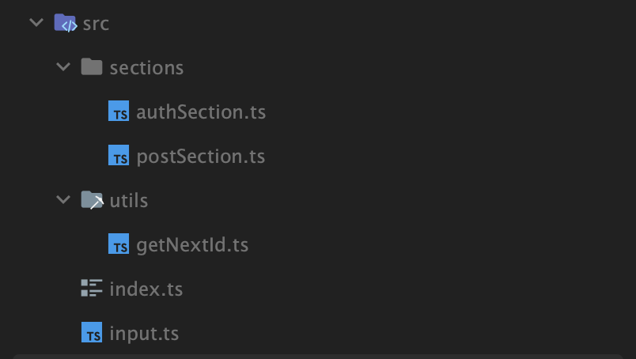

# 수업 후 과제

<aside>
❗ 과제를 내다 보니 생각보다 어려울 수 있겠더라구요.. 하다 안될때 무조건 연락 주세요 예상컨데.. 저한테 최소 1번 연락하셔야 과제를 다 하실 수 있을 것 같습니다 😈
</aside>

## 기한 및 방식

- 돌아오는 주가 휴강인 관계로, **4월 26일 (수) 00:00 (화요일 23:59 1분 뒤)** 까지입니다!
- GitHub에 레포 하나 파서 올려주시고, 슬랙 쓰레드에 링크를 남겨주세요!

## 만들어야 하는 것

- 인스타그램의 간단한 CLI 버전 프로그램을 만드는 것입니다.
  (사실 사진 업로드 기능이 없으니 인스타라기보단 트위터에 가깝긴 합니다)

[멋사 명지대(자연) 섭팟 3주차 수업 후 과제](https://asciinema.org/a/3si5W1rPxs7jMgfOycGar1npQ)

테스트용 실행 파일 (어떻게 돌아가는건지 궁금하실 때 실행시키는 용입니다)

[Archive.zip](./Archive.zip)

### 신경써야 하는 것

- 적당한 코드 분리

### 신경쓰지 않아도 되는 것

- 최적화

### 타입은 어디까지?

1. 타입을 지정해주지 않아도 정확하게 타입 추론이 된다면 넣어주지 않으셔도 됩니다.

    ```tsx
    const a = 1;  // a: number 라고 정확하게 추론 됨
    
    const b = {
      c: false;
    };  // b: {c: boolean} 라고 정확하게 추론 됨
    ```

2. 타입을 지정해주지 않았는데 정확한 타입 추론이 되지 않는다면 넣어주셔야 합니다.

    ```tsx
    const numbers = [];  // 이러면 numbers: any[] 라고 추론되므로 이러시면 안됩니다
    const numbers: number[] = [];  // 이러셔야 합니다.
    
    // ---
    
    // 지난 시간에 배운 array of objects 의 경우도 무조건 타입 추론해주셔야 합니다.
    // 라잌 디스 👇
    type Student = {
      id: number;
      name: string;
      age: number;
    };
    
    let students: Student[] = [];
    
    ```

3. 함수의 파라미터는 모두 타입 정의를 해주셔야 합니다. 다만 return type 은 정확히 추론된다면 정의하지 않으셔도 됩니다.

    ```tsx
    const add = (x: number, y: number) => x + y;  // O
    ```

### Tip!

- JS, TS 에서 Reference type (Object, Array 등) 은 그냥 함수에 넘기면 call by reference 로 호출이 된답니다. 이게 무슨 소린지 모른다면 @유예빈 에게 🤙
- 제 폴더구조는 아래와 같습니다. 똑같이 하실 필요는 없고, 참고용입니다!

  
